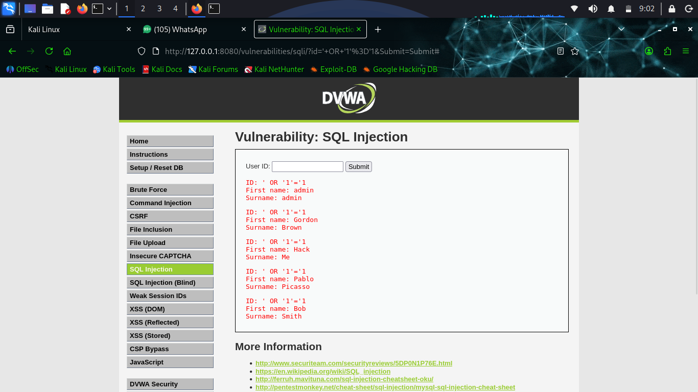
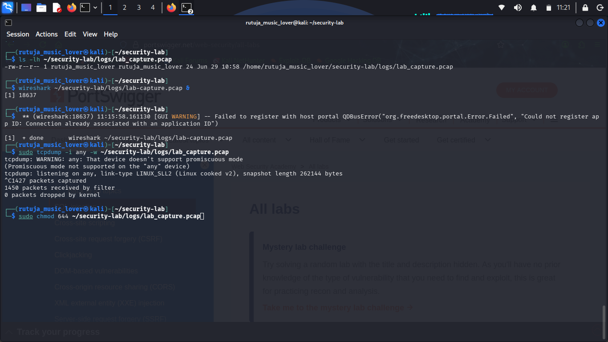
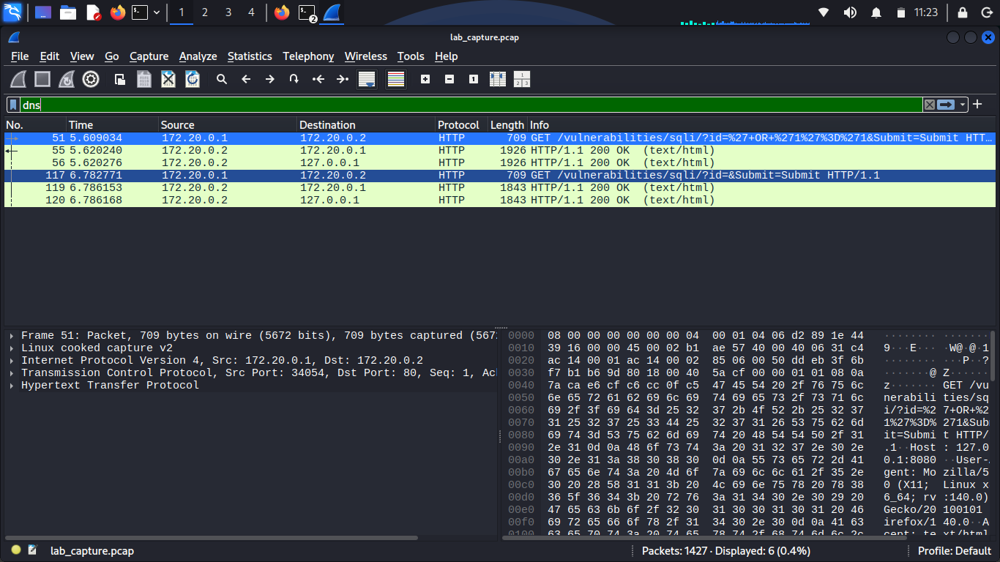
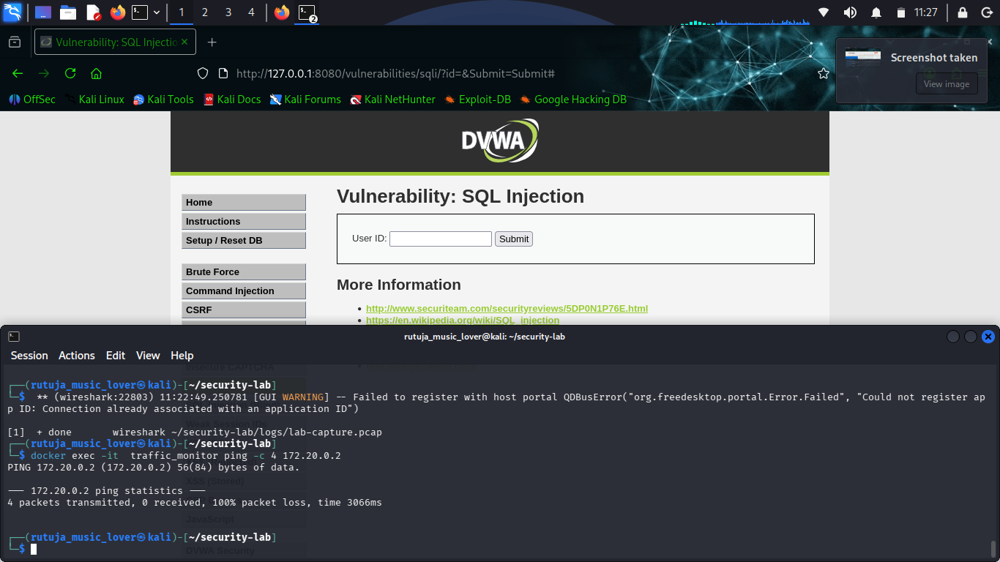
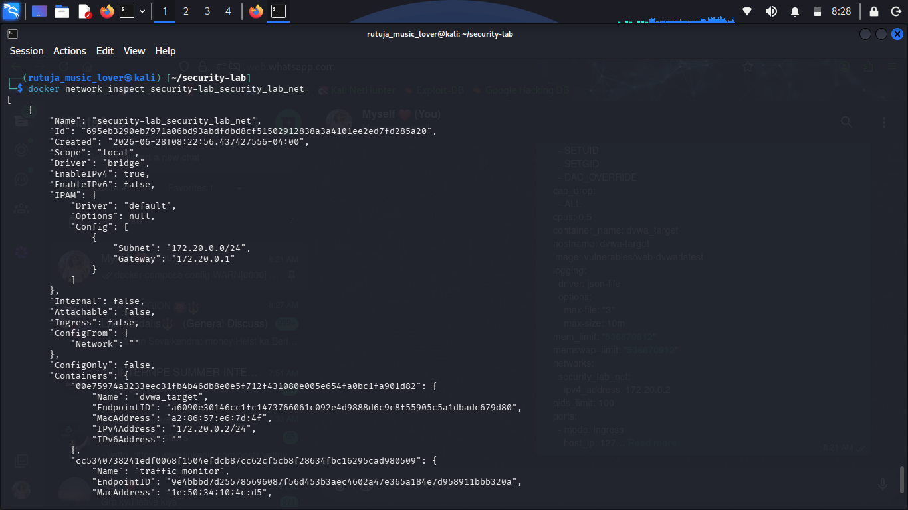

## Evidence & Screenshots

### 1. Docker Hardening Configuration


*CIS Docker Benchmark controls: icc=false, no-new-privileges=true, userland-proxy=false*

### 2. DVWA SQL Injection Attack





*Successful exploitation of SQL injection vulnerability: ' OR '1'='1 bypasses authentication*

### 3. TCPDump Traffic Capture





*Real-time packet capture on isolated Docker network*

### 4. Wireshark HTTP Payload Analysis





*HTTP POST request containing SQL injection payload captured in pcap file*

### 5. Network Isolation Test (Ping Failure)





*Monitor container cannot reach DVWA due to ICC (Inter-Container Communication) disabled*

### 6. Capture File Verification


*Lab_capture.pcap successfully created on Kali host via docker cp*

### 7. Docker Network Inspection





*Both containers connected to security-lab_security_lab_net with correct IPs*

## How to Reproduce This Lab

### Prerequisites
- Kali Linux with Docker installed
- 8GB RAM minimum
- 10GB free disk space

### Quick Start
```bash
git clone https://github.com/yourusername/docker-security-lab
cd docker-security-lab
docker-compose up -d
firefox http://127.0.0.1:8080
